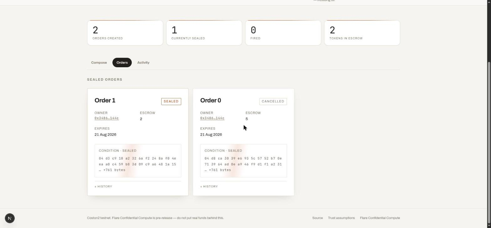
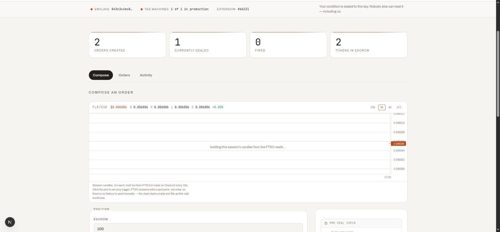
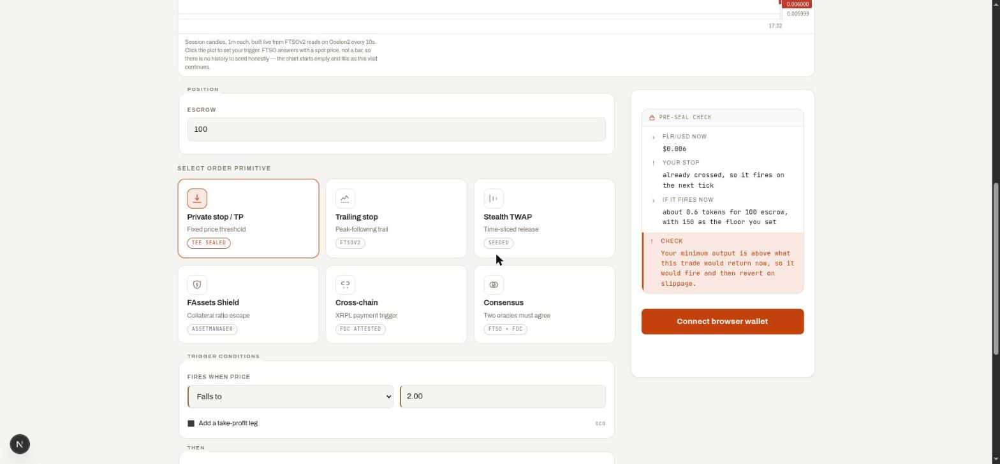
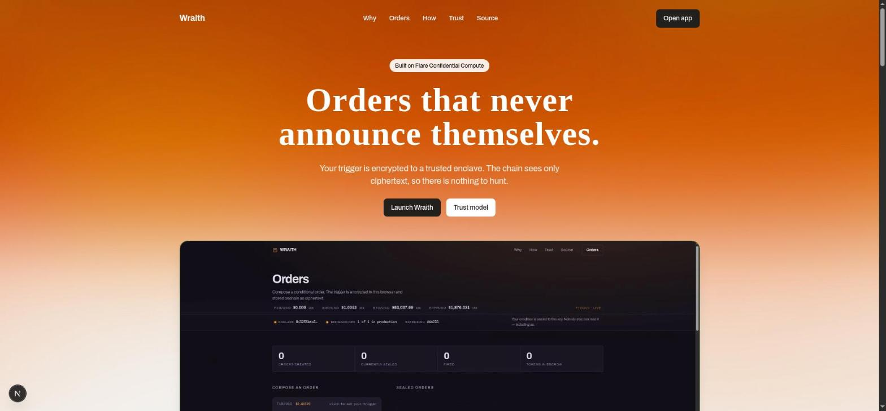

<div align="center">
 

# Wraith

**Conditional orders that never announce themselves.**

Encrypted conditions in, attested execution out.

[](https://github.com/LSUDOKO/Wraith/actions/workflows/ci.yml)
[](https://github.com/LSUDOKO/Wraith/releases)
[](https://coston2.testnet.flarescan.com/address/0xd5A5322F3D9bB9b2Ee73d006383BB03f61A04eCD)
[](#verification)
[](LICENSE)

[**Live app**](https://wraith-jet.vercel.app) · [Trust model](docs/TRUST.md) · [Deploy runbook](docs/DEPLOY.md) · [Known issues](docs/KNOWN-ISSUES.md)

</div>

---

## Hackathon tracks

Wraith is submitted to **both** tracks, and needs both to exist:

| Track | How Wraith uses it |
| --- | --- |
| **Confidential Compute Apps** (TEE) | The private condition evaluation *is* the product. A Flare Compute Extension decrypts and evaluates each order inside a TEE, and the plaintext condition exists nowhere else — not on chain, not in the keeper, not in this repo's own backend. |
| **Interoperable Asset Products** (FAssets / FXRP) | A fired trigger settles in FAssets: swap FXRP through BlazeSwap, or redeem it to **native XRP on the XRPL**. The FAssets Shield primitive also triggers *on* FAssets agent health — an escape hatch that only exists because FAssets exposes agent collateral on-chain. |

The combination is the point. A TEE alone gives you a private condition with nothing to settle into; FAssets alone gives you cross-chain settlement that has to announce itself first. Flare is the only chain where the secret condition can also reference another chain's state, decentralized prices, and a bridgeless XRP redemption in one transaction.

---

## The problem

Every onchain automation protocol today — Gelato, Chainlink Automation, onchain limit-order books, every DeFi stop-loss — publishes the **trigger condition in the clear**. A standing order sits onchain for hours or days announcing exactly what you will do and exactly when.

The best-documented consequence is **stop-loss hunting**: because your stop price is public, price gets deliberately pushed to it. A resting stop is a public commitment to sell at a known level, and pushing price into a visible cluster of stops is profitable *precisely because* the cluster is visible.

Traders have two defences today. Keep the stop on a centralised exchange and accept custody risk, or keep it in your head and accept being asleep when it matters. Neither is a good trade.

Wraith is the third option.

## The solution

Your condition is encrypted to a TEE's public key **in your own browser** and stored onchain as ciphertext. A Flare Compute Extension running inside a Trusted Execution Environment is the only party that can read it. It evaluates the condition against live FTSO prices and emits a **signed result only when the condition fires**. A Flare smart contract verifies that signature and settles.

Nobody — not a searcher, not an indexer, not the keeper that pokes the system — can see what you are waiting for.

```
 ┌── your browser ──────────┐
 │  condition encrypted     │   plaintext exists only here, and in the enclave
 └────────────┬─────────────┘
              ▼
      createOrder(bytes)          ← chain stores ciphertext + escrow, nothing else
              │
   keeper ──► tick(orderId)       ← permissionless; forwards bytes it cannot read
              ▼
 ┌── TEE enclave ───────────┐
 │  decrypt → read FTSO     │   reads the oracle itself, so the keeper cannot lie
 │  → evaluate condition    │
 └────────────┬─────────────┘
              │ fired? sign a settlement.  not fired? indistinguishable no-op.
              ▼
      execute(result, sig)        ← registry-checked signer, replay guard, then settle
```

The no-op and the fired path are deliberately **indistinguishable by status**, so an observer watching tick traffic cannot infer how close an order is to its trigger. Tests enforce this.

---

## Proof it runs

Everything below is from the live Coston2 deployment. Every command is copy-pasteable and re-runnable by a judge.

### The condition really is opaque on-chain

Read a live sealed order straight from the contract — no frontend involved:

```bash
cast call 0xd5A5322F3D9bB9b2Ee73d006383BB03f61A04eCD \
  'getOrder(uint256)(address,address,uint256,uint64,bool,bool,bytes)' 1 \
  --rpc-url https://coston2-api.flare.network/ext/C/rpc
```

Returns the owner, the escrowed token, the amount, the expiry — and then the condition, as 785 bytes of this:

```
0x04d3c910a2326af2248af04eeaa0c459b83d09c9a6481a15cd851c275b3a7e72c111c55e2e1e1e2a
8aa844a26839dfa715806b7da026205e5b677d466cc407887f54a7848f249bcda8921c8baf3b10667…
```

There is no trigger price in there to find. The escrow, the owner and the expiry are public by necessity; the condition is not.

<div align="center">
 
 <br />
 <em>The same orders in the app. The chain holds the ciphertext; the UI cannot decrypt it either.</em>
</div>

### The enclave really is live

```bash
curl -s https://exhale-wolf-snowstorm.ngrok-free.dev/info | jq '.teeInfo.publicKey, .machineData.extensionId'
```

That is the TEE machine's own signed identity — the public key your browser seals to, and extension `0x102b7` (66231). Cross-check it against Flare's registry, which is the authority on who may settle:

```bash
cast call 0x1a9C4A0f9D76c0b1D91d22E24E573a9b377618aE \
  'getActiveTeeMachines(uint256)(address[],string[])' 66231 \
  --rpc-url https://coston2-api.flare.network/ext/C/rpc
# [0x7340824cF076C52a53b2c2c63b504a554cF06A38]
# ["https://exhale-wolf-snowstorm.ngrok-free.dev"]
```

One active machine, and the URL matches. `execute()` accepts a signature from that address and no other.

<div align="center">
 
 <br />
 <em>The app reads the same registry: enclave key, <code>1 of 1 in production</code>, extension #66231.</em>
</div>

### The op codes really match

FCC routes an instruction by two `bytes32` constants that must be byte-identical in Solidity and Go. A mismatch is the documented #1 cause of `unsupported op type`:

```bash
cast call 0xd5A5322F3D9bB9b2Ee73d006383BB03f61A04eCD 'OP_TYPE_WRAITH()(bytes32)' \
  --rpc-url https://coston2-api.flare.network/ext/C/rpc
# 0x5752414954480000…  →  "WRAITH"
cast call 0xd5A5322F3D9bB9b2Ee73d006383BB03f61A04eCD 'OP_COMMAND_EVAL_ORDER()(bytes32)' \
  --rpc-url https://coston2-api.flare.network/ext/C/rpc
# 0x4556414c5f4f5244455200…  →  "EVAL_ORDER"
```

Both decode to exactly the strings in [`extension/internal/config/config.go`](extension/internal/config/config.go). Verified against the live contract, not against a doc.

---

## Features

| | |
| --- | --- |
| **Private stop-loss / take-profit** | Trigger price is never published, so it cannot be hunted |
| **OCO brackets** | Stop and take-profit share one escrow; whichever fires first settles, the other dies with it |
| **Trailing stop** | The stop follows price up and never back down; the peak is public, the trail distance is not |
| **Stealth TWAP** | A large order splits into tranches at times and sizes derived from a sealed seed |
| **FAssets Shield** | Escape an FAssets agent whose collateral is falling, on a threshold nobody can see |
| **Cross-chain triggers** | Fire on an FDC-attested XRPL payment; the watched address travels only as its FDC hash |
| **Multi-oracle consensus** | Settles only when FTSO *and* an attested off-chain price agree — one feed alone cannot move a stop |
| **Gasless orders** | Sign an intent, a sponsor pays the gas and takes its fee in the escrowed token |
| **Cross-chain settlement** | Swap FXRP, or redeem it to native XRP on the XRPL |
| **Owner-only recall** | Read your own condition back, from a device-local copy — the chain still holds only ciphertext |
| **Live system status** | Enclave key and TEE machine count read straight from the FCC registry |
| **Browser notifications** | Alerts when your order executes or is cancelled |
| **Telegram alerts** | Subscribe your wallet in-app; the keeper messages you when your order fires, tab open or not |
| **Wallet support** | Injected wallets plus WalletConnect for mobile and hardware |

<div align="center">
 
 <br />
 <em>Six primitives, one sealed-condition mechanism. The pre-seal check simulates the fire before you commit.</em>
</div>

## Deployment

| | |
| --- | --- |
| **Network** | Flare Coston2 (chain 114) |
| **WraithOrders** | [`0xd5A5322F3D9bB9b2Ee73d006383BB03f61A04eCD`](https://coston2.testnet.flarescan.com/address/0xd5A5322F3D9bB9b2Ee73d006383BB03f61A04eCD) |
| **FCC extension ID** | `0x102b7` (66231) |
| **Active TEE machine** | [`0x7340824cF076C52a53b2c2c63b504a554cF06A38`](https://coston2.testnet.flarescan.com/address/0x7340824cF076C52a53b2c2c63b504a554cF06A38) |
| **FCC registry** | [`0x1a9C4A0f9D76c0b1D91d22E24E573a9b377618aE`](https://coston2.testnet.flarescan.com/address/0x1a9C4A0f9D76c0b1D91d22E24E573a9b377618aE) — FlareTeeManager diamond |
| **FdcVerification** | [`0x906507E0B64bcD494Db73bd0459d1C667e14B933`](https://coston2.testnet.flarescan.com/address/0x906507E0B64bcD494Db73bd0459d1C667e14B933) |
| **FtsoV2** | [`0x3d893C53D9e8056135C26C8c638B76C8b60Df726`](https://coston2.testnet.flarescan.com/address/0x3d893C53D9e8056135C26C8c638B76C8b60Df726) |
| **AssetManagerFXRP** | [`0xc1Ca88b937d0b528842F95d5731ffB586f4fbDFA`](https://coston2.testnet.flarescan.com/address/0xc1Ca88b937d0b528842F95d5731ffB586f4fbDFA) |
| **FXRP** | [`0x0b6A3645c240605887a5532109323A3E12273dc7`](https://coston2.testnet.flarescan.com/address/0x0b6A3645c240605887a5532109323A3E12273dc7) |
| **Router** | [`0x8D29b61C41CF318d15d031BE2928F79630e068e6`](https://coston2.testnet.flarescan.com/address/0x8D29b61C41CF318d15d031BE2928F79630e068e6) — BlazeSwap |
| **WC2FLR** | [`0xC67DCE33D7A8efA5FfEB961899C73fe01bCe9273`](https://coston2.testnet.flarescan.com/address/0xC67DCE33D7A8efA5FfEB961899C73fe01bCe9273) |
| **FLR/USD feed** | `0x01464c522f55534400000000000000000000000000` |

Two details worth stating, because both were verified rather than assumed:

- `AssetManagerFXRP` was resolved live from the `FlareContractRegistry`, and its `fAsset()` returns exactly the FXRP address above. The two agree independently, so neither is a stale copy from a doc.
- `router()`, `assetManager()` and `fdcVerification()` read back off the deployed contract as the addresses in this table. The wiring is confirmed on-chain, not just in a deploy script.

Full sequence: [`docs/DEPLOY.md`](docs/DEPLOY.md).

## Flare integration

Wraith uses four Flare protocols, and would not work with any one of them removed.

### FCC — Confidential Compute

The private evaluation. A Go extension ([`extension/`](extension)) runs inside the TEE, decrypts each order through the TEE node's `/decrypt` endpoint, evaluates the condition, and returns a signed `ActionResult`. `WraithOrders` is its own FCC `InstructionSender`, so the contract holding escrow is the same one dispatching instructions and verifying results.

The extension holds **no state between ticks**. There is no sealed storage in FCC, so the onchain ciphertext is canonical and the enclave re-decrypts on every tick. Anything that looks like memory — a TWAP's position in its schedule, a trailing stop's peak — is either derived from a sealed seed or read back from the contract.

### FTSO — price triggers

Read **inside the enclave**, over RPC, from block-latency feeds. This is the design decision that puts the keeper outside the trust path: the keeper never supplies a price, so a hostile keeper cannot fake a crossing. It can withhold ticks — which is why ticking is permissionless and anyone can do it.

### FDC — cross-chain and second-oracle triggers

Two uses. `Payment` attestations fire an order on an XRPL payment; `Web2Json` supplies the second oracle in a consensus order.

FDC is a Flare **system** application with no interface a third-party extension may call, so the enclave cannot request an attestation itself. The proof therefore arrives from outside: the keeper fetches it from the DA Layer, `tickAttested` verifies it **on-chain** against a finalized round, and only the verified reading crosses into the enclave. By the time the extension sees it, `verified` reflects a Merkle check rather than the keeper's word — which is what lets the enclave refuse an unverified attestation outright.

The watched XRPL address never appears on chain. It travels as the FDC standard address hash, in the sealed terms and in the tick alike, and that hash is pinned in a test to **Flare's own published XRPL vector** — matching a documented value proves it is the hash FDC computes, not merely one both halves of this repo agree on.

### FAssets / FXRP — settlement

A fired trigger swaps FXRP through BlazeSwap or redeems it to native XRP on the XRPL. Redemption is lot-granular, and the FAssets Shield primitive reads `getAgentInfo` from inside the enclave to fire on an agent's collateral ratio.

`getAgentInfo` returns a 40-field struct containing a dynamic `string`, which makes both `cast` and viem's tuple decoders fail on it. Both sides decode positionally instead, and the field offsets are pinned by a test using **real captured chain bytes** — a hand-built fixture would encode the same misreading the parser might make.

## What Wraith does *not* claim

Wraith hides **standing intent**. It does not hide the execution transaction — once a trigger fires, the resulting trade is an ordinary public transaction, as exposed to execution-moment MEV as any other. Anyone claiming a TEE makes a trade MEV-proof is overselling.

The narrower claim is the one that holds: **the condition was never public, so it could never be hunted.**

Every assumption behind that is written down in [`docs/TRUST.md`](docs/TRUST.md) — onchain ciphertext exposure, `SIMULATED_TEE` on testnet, what the registry does and does not guarantee, and the fact that a keeper can censor but cannot lie.

## Security model

`execute()` accepts a result only if all of the following hold:

| Check | Prevents |
| --- | --- |
| Recovered signer is an **active TEE** for this extension, per `getActiveTeeMachines` | Forged results |
| `actionId` has not been consumed | Replaying one signed result to execute an order twice |
| `contractAddr` equals `address(this)` | Replaying a result against a different Wraith deployment |
| `status == 1` | Relaying a failed TEE result |
| Order is live — not executed, cancelled, or expired | Settling a dead order |

The signed payload is `keccak256(abi.encode(TEE_ACTION_RESULT_PREFIX, block.chainid, ActionResult.Hash()))` under the EIP-191 prefix. Including `block.chainid` is what stops a result signed on one chain being replayed on another.

**Signer authority comes from the registry, not from the contract owner.** There is no owner-controlled allowlist — a test asserts that even the owner cannot authorise a signer of their choosing, and retiring a machine in the registry revokes its ability to settle immediately.

## Repository

| Path | What |
| --- | --- |
| [`contracts/`](contracts) | `WraithOrders.sol`, Foundry tests, Coston2 deploy script |
| [`extension/`](extension) | Flare Compute Extension (Go): pure trigger core + enclave runtime |
| [`keeper/`](keeper) | Permissionless tick-and-relay loop |
| [`frontend/`](frontend) | Next.js app — seals conditions client-side |
| [`docs/TRUST.md`](docs/TRUST.md) | Trust assumptions, stated plainly |
| [`docs/DEPLOY.md`](docs/DEPLOY.md) | End-to-end Coston2 runbook |
| [`docs/KNOWN-ISSUES.md`](docs/KNOWN-ISSUES.md) | Live-stack findings and operational traps |
| [`AGENTS.md`](AGENTS.md) | Repo guide for coding agents |

## Quick start

```bash
git clone --recurse-submodules https://github.com/LSUDOKO/Wraith.git
cd Wraith

cd contracts   && forge test                            # 98 tests
cd ../extension && go vet ./... && go test ./... -race   # 80 tests
cd ../keeper    && npm ci && npm test                    # 37 tests
cd ../frontend  && npm ci && npm test && npm run dev     # 64 tests
```

Copy `frontend/.env.example` to `.env.local` — the deployed address is already filled in. Connect MetaMask on Coston2 and fund it from the [faucet](https://faucet.flare.network/coston2).

Routes: `/` explains the product, `/app` is the order composer, `/app/orders` the order book, `/app/activity` the chain log and alert settings.

### Using the app

1. Open [the app](https://wraith-jet.vercel.app/app) and connect a wallet on Coston2
2. Click **Wrap 5 C2FLR** to fund escrow from faucet funds
3. Pick a primitive, set an escrow amount, a trigger, and an expiry
4. **Seal and submit** — the condition is encrypted in your browser, then two wallet prompts
5. Your order appears with its condition shown as **unreadable ciphertext**. Check the block explorer: the trigger price genuinely is not there
6. Cancel any time to reclaim the escrow

<div align="center">
 
</div>

## Verification

**279 tests across four languages**, all run in CI on every push:

| Suite | Count | Covers |
| --- | --- | --- |
| `contracts` | 98 | Escrow, settlement, forged signatures, replay, cross-deployment reuse, expiry, cancellation, rate limiting, partial fills, peak tracking, FDC proof rejection, gasless intent forgery and replay |
| `extension` | 80 | Trigger evaluation and boundaries for all six kinds, decimal normalization, stale-price and stale-attestation refusal, oracle disagreement, ABI round-trips, no-op indistinguishability |
| `keeper` | 37 | Proxy response handling, relay decisions, notification privacy and routing, attestation encoding and reuse windows |
| `frontend` | 64 | Price parsing, cipher rendering, analytics scrubbing, FDC address hashing, event timelines |

Four properties are enforced by test rather than convention:

- **The settlement payload carries no trace of the threshold or direction.** A test greps the encoded result for the secret bytes.
- **Analytics can never carry order terms.** Term-bearing keys are dropped at any nesting depth, because a trigger price is a plain decimal that no value-level pattern can distinguish from a legitimate metric.
- **The contract owner cannot authorize a signer of their choosing.** Settlement authority comes from the TEE machine registry, and a test asserts the owner has no way to add to it.
- **The FDC address hash matches Flare's published vector.** Hashing the documented XRPL example proves both halves compute the hash FDC computes, rather than agreeing on the same mistake.

## Status

Coston2 testnet only. Flare Confidential Compute is itself pre-release. **Do not put real funds behind this.**

The contract, dispatch, registration and enclave routing are verified working end to end — an instruction reaches the enclave and routes as `WRAITH`/`EVAL_ORDER`. Current operational limitations are tracked honestly in [`docs/KNOWN-ISSUES.md`](docs/KNOWN-ISSUES.md), including the FCC traps that cost real debugging time.

Report vulnerabilities privately — see [SECURITY.md](SECURITY.md).

## Contributing

[`CONTRIBUTING.md`](CONTRIBUTING.md) covers setup, the Conventional Commits that drive releases, and the invariants that are not style preferences.

## License

[Apache-2.0](LICENSE)
